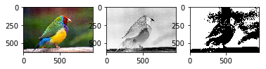

```python
from scipy import ndimage
from scipy import misc
import matplotlib.pyplot as plt
import numpy as np
```


```python
def convert_RGB_to_BW(img, threshold = 100):
    res = np.zeros((img.shape[0], img.shape[1]))
    for i in range(res.shape[0]):
        for j in range(res.shape[1]):
            # 3 bileşenlerin ortalaması belirlenen threshold üstünde ise 1 olarak kabul edeceğiz
            if(sum(img[i,j,:])/3 > threshold):
                res[i,j] = 1
            # değil ise 0 olarak kabul edeceğiz
            else:
                res[i,j] = 0
    return res
```


```python
def convert_RGB_to_Gray(img):
    # boş 2 boyutlu bir sıfırlar matrisi oluşturuyoruz, sonuç burda olacak
    res = np.zeros((img.shape[0], img.shape[1]))

    for i in range(res.shape[0]):
        for j in range(res.shape[1]):
                # Yeni değer i. satırdaki ve j. sütündeki hücre 3 bileşenlerin ortamı olacak
                res[i,j] = sum(img[i,j,:])/3
    return res
```


```python
original =  plt.imread("Bird.jpg")
bw = convert_RGB_to_BW(original,75)
gray = convert_RGB_to_Gray(original)
```


```python
plt.subplot(1,3,1), plt.imshow(original)
plt.subplot(1,3,2), plt.imshow(gray, cmap='Greys')
plt.subplot(1,3,3), plt.imshow(bw, cmap='Greys')

plt.show()
```



