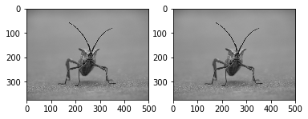
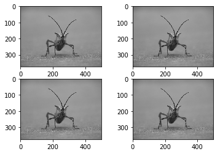

[Bu tutorial'da](http://matplotlib.org/users/image_tutorial.html) bulunan örnekleri inceleyelim


```python
# Bu satirda matplotlib'e söylüyoruz ki graflar ve
# fotoğraflar notebook sayfasında göster.
%matplotlib inline
```


```python
import matplotlib.pyplot as plt
import matplotlib.image as mpimg
import numpy as np
```


```python
# Bug.png dosyasinda bulunan image'i okuyoruz
img = mpimg.imread('Bug.png')
```


```python
# Notebook üzerinde yazdırmak için
imgplot = plt.imshow(img)
```


Fotoğrafın özelliklerine bakalım :


```python
print('ndim  :', img.ndim)
print('shape :', img.shape)
```

    ndim  : 3
    shape : (375, 500, 3)


Aynı plot'ta birden fazla foto veya şekil yazdırmak için ``subplot`` kullanabilirz

imshow çağırmadan önce :

```python
#plt.subplot(satır sayısı, kolon sayısı, kaçıncı hücre kullanacağız)
```

Çağırmak yeterli olacak.

Örnek:


```python
plt.subplot(1,2,1), plt.imshow(img)
plt.subplot(1,2,2), plt.imshow(img)
plt.show()
```





Veya 2 x 2 bir şekil için :


```python
plt.subplot(2,2,1), plt.imshow(img)
plt.subplot(2,2,2), plt.imshow(img)
plt.subplot(2,2,3), plt.imshow(img)
plt.subplot(2,2,4), plt.imshow(img)
plt.show()
```



